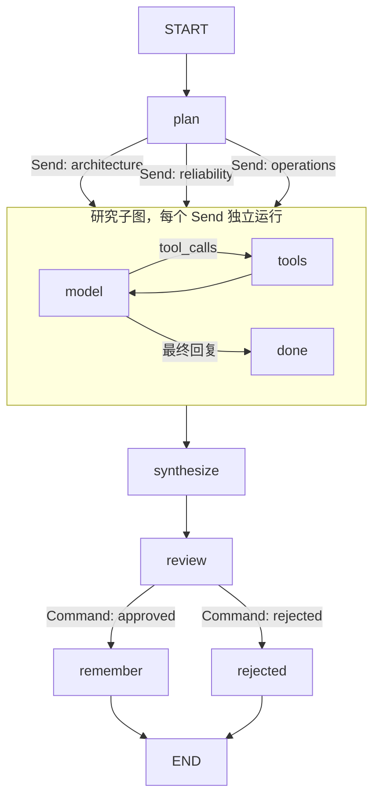

# LangGraph Agent 能力实验室（Python + DeepSeek）

一个可以运行、暂停、跨进程恢复、查看历史并创建执行分支的研究助手。所有工作流由 **LangGraph StateGraph / Functional API** 编排，没有使用 `create_agent`、其他 Agent 框架或隐藏编排层。`langchain-core` 提供消息和工具协议，`langchain-openai` 仅作为 **DeepSeek 的兼容 API 客户端**，不会请求 OpenAI 服务。

默认离线，无需密钥；真实模式使用 DeepSeek。离线模式是确定性模拟模型决策，但图、工具、并行、checkpoint 和 interrupt 都真实执行。知识库仅包含教学资料，不是联网搜索。规划和汇总使用确定性 Python，真实模型用于研究子图中的工具决策与回答。

## 立即运行

项目已创建 `.venv`。在项目目录执行：

```bash
source .venv/bin/activate
lg-demo run --stream updates
python examples/advanced.py
pytest -q
```

全新环境安装（Python 3.11+）：

```bash
python3 -m venv .venv
source .venv/bin/activate
pip install -e '.[dev]'
```

`requirements.lock.txt` 是本次验证环境的精确版本快照；需要复现时先 `pip install -r requirements.lock.txt`，再 `pip install -e . --no-deps`。实际验证：Python 3.12、LangGraph 1.2.11。

## DeepSeek API

```bash
export DEEPSEEK_API_KEY='你的 DeepSeek API Key'
export DEEPSEEK_MODEL='deepseek-chat'
export DEEPSEEK_BASE_URL='https://api.deepseek.com'
lg-demo run --real-model --stream messages --question '如何构建可恢复的研究 Agent？'
```

配置参考 `.env.example`，程序读取环境变量，不自动加载 `.env`。模型名称可按账号当前可用模型调整。默认普通聊天模式，工具循环最多四次模型调用；每次请求超时 60 秒，客户端最多重试两次。没有密钥时给出明确错误。`messages` 模式在真实模型执行时可展示 token chunk；离线主要观察 `updates` 和 `custom`。

## 流程



默认自动通过审核。`--review` 是学习 LangGraph 人工介入能力的可选开关。

## 中断和跨进程恢复

```bash
lg-demo run --thread review-001 --review
lg-demo state --thread review-001
lg-demo resume --thread review-001
# 若要演示拒绝，在另一个暂停的会话运行：
# lg-demo resume --thread other-review --reject
```

真实模型模式恢复时继续带 `--real-model`。SQLite 位于 `.demo/checkpoints.sqlite`；更换位置使用 `--db`，所有后续命令要使用相同位置。恢复使用相同 `thread_id`。CLI 禁止向已有 thread 再次提交新 run，避免教学中的 append reducer 混合两次研究结果；新问题使用新 thread。

## 检查点与时间旅行

```bash
lg-demo history --thread review-001
# 从 history 复制一个 next 为 review 的 checkpoint ID：
lg-demo fork --thread review-001 --checkpoint '复制的 ID' --report '这是人工修订后的报告'
lg-demo state --thread review-001
```

`fork` 调用 `update_state(..., as_node='synthesize')` 创建新检查点，再从 review 继续。分支位于同一个 thread 的历史中，不是创建新 thread；旧检查点不被覆盖。恢复历史可能重新执行后续节点和外部调用，不是只回放已保存文本。

## 能力与源码对应

| 能力 | 实现位置 | 验证入口 |
|---|---|---|
| TypedDict State、部分更新、START/END | `src/langgraph_demo/graph.py` | `lg-demo run` |
| `add_messages` 消息 reducer | State / ResearchState | 最终消息与工具消息 |
| 并发 reducer、Send 动态 fan-out/fan-in | dispatch / research / synthesize | 三个 findings 汇总 |
| 自定义 ReAct、ToolNode、工具异常消息 | research_graph | model → tools → model |
| 条件边和循环退出 | tools_condition | 有工具调用则进入 ToolNode |
| 子图独立状态、父图映射 | research 调用 researcher | `--stream updates` 含子图命名空间 |
| Runtime context 依赖注入 | Context | 用户身份、输出偏好、审核开关 |
| 短期记忆、SQLite checkpoint | CLI | run / state / resume |
| interrupt + Command.resume | review | `--review` |
| Command.update + goto | review | 通过与拒绝两条分支 |
| checkpoint history / update_state | CLI | history / fork |
| 流式 updates / values / custom / messages / debug | CLI | `--stream` |
| get_stream_writer 自定义进度 | plan / research | `--stream custom` |
| 长期记忆接口 Store、用户 namespace | remember / plan | advanced.py 同用户跨 thread |
| RetryPolicy 自动重试 | advanced.py | 故意第一次失败，第二次成功 |
| CachePolicy + InMemoryCache | advanced.py | 同输入第二次执行命中缓存 |
| Functional API @entrypoint / @task | advanced.py | 并行平方求和 |
| ainvoke / astream | advanced.py | 异步调用和流式消费 |
| 执行上限 | CLI recursion_limit、model_turns | 防止无限工具循环 |
| Mermaid 图导出 | CLI | `lg-demo diagram` |
| LangSmith 观测（可选） | `.env.example` | 设置 tracing 环境变量 |

## 测试与阅读顺序

```bash
pytest -q
ruff check src examples tests
ruff format --check src examples tests
lg-demo diagram
```

先读 `graph.py` 的 State 和 build_graph，再读 research_graph，然后 CLI 的 checkpoint / resume / fork，最后读 `examples/advanced.py` 和 `docs/concepts.md`。

测试覆盖并行聚合、真实 ToolNode 本地执行、审核通过/拒绝、SQLite 关闭重开、独立进程恢复、历史分支不可变、子图流事件、用户记忆隔离、输入校验、重试、缓存、异步和 DeepSeek 配置。不含真实付费 API 调用。

## 演示边界

- `InMemoryStore` 展示跨 thread 记忆，但仅在同一进程内有效；它与持久化 SQLite checkpointer 是两个系统。CLI 重启后用户偏好 Store 不保留。生产可替换为持久化 Store。
- Checkpoint 不保证外部副作用 exactly-once。中断节点恢复会从头执行，外部写入应使用幂等键。示例偏好保存使用固定键 put。
- 研究主题固定三项；这使路由与并行容易观察，不是通用联网研究产品。
- 这是教学 CLI，不包含 Web 服务、身份认证、分布式队列或生产部署。没有配置 API Key，因此真实 DeepSeek 连通性与服务端模型可用性尚未验证。

## 官方资料

- [LangGraph Graph API](https://docs.langchain.com/oss/python/langgraph/graph-api)
- [持久化](https://docs.langchain.com/oss/python/langgraph/persistence)
- [人工介入](https://docs.langchain.com/oss/python/langgraph/interrupts)
- [Functional API](https://docs.langchain.com/oss/python/langgraph/functional-api)
- [DeepSeek API](https://api-docs.deepseek.com/)
- [DeepSeek Tool Calls](https://api-docs.deepseek.com/guides/tool_calls/)
